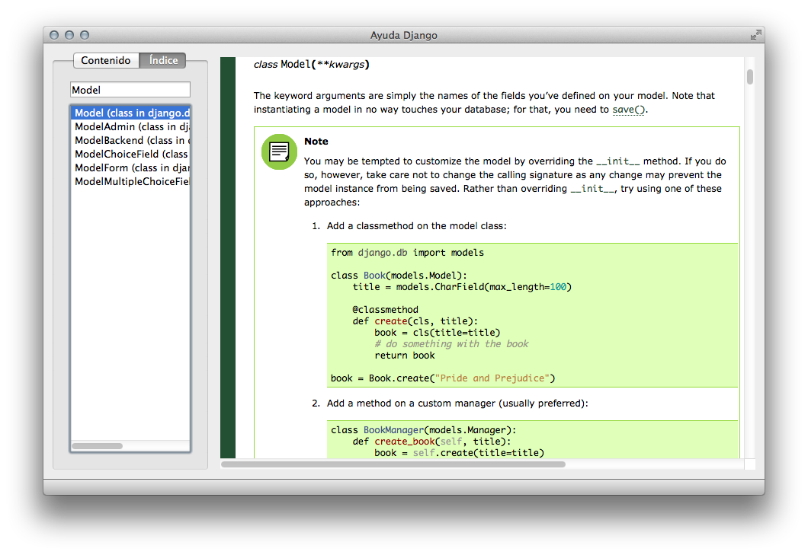

# Lector de ayuda de Django

Aplicación para buscar en la documentación HTML de Django.

### Requisitos

- Python 3 (probando sobre Python 3.4)
- PyQt5 y Qt5
  En OS X, puede ser instalado fácilmente con Homebrew usando `brew install pyqt5`
- BeautifulSoup4 (`pip install beautifulsoup4`)
- Documentación de Django en formato HTML descargada.

### Implementado

- Índice (generado sobre la marcha usando la documentación)
- Búsqueda sobre ese índice

### Por implementar

- Usar un "split view" o similar para hacer la barra lateral redimensionable.
- Pestaña "Contenido". Muestra la documentación por temas.
- Caché del índice generado.
- Marcadores.
- Botones atrás/adelante para navegación.
- Opción de usar la documentación en línea en lugar de tener que descargar la versión offline,
  o bien ofrecer la descarga automática en la primera ejecución del programa.
- Usar Sphinx para generar la documentación?

### Licencia

Este programa usa la licencia GPL3, disponible en el archivo de texto `LICENSE`.
